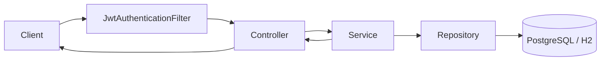

# Customer Support Hub - Architecture Overview

## 1. Purpose

Customer Support Hub is a Spring Boot backend for a multi-tenant support desk.
The system is designed to:

- authenticate users with JWT
- isolate data by `organization` and `workspace`
- manage customer requests, comments, and attachments
- provide a foundation for a knowledge base, AI assistant, notifications, and observability

This repository is the main backend for the JavaSpring version of the project.

## 2. Tech Stack

### Backend

- Java 17
- Spring Boot 3.3.x
- Spring Web
- Spring Security
- Spring Data JPA
- Flyway
- PostgreSQL
- H2 for local and test runs

### Supporting libraries

- JJWT for access tokens
- Spring Validation for request validation
- Spring Actuator for health and metrics
- WebSocket configuration is already in place for future realtime flows

### Storage and infrastructure

- PostgreSQL stores the primary application data
- Local filesystem stores attachments during local development
- Redis is available as a base integration for caching and rate limiting flows

## 3. High-Level Layers

The code is organized by domain:

- `auth`: register, login, refresh, logout, and me
- `organization`: company and organization management
- `workspace`: workspace management inside an organization
- `membership`: role assignment and team management
- `workflow`: customer request CRUD and audit events
- `comment`: request comments
- `attachment`: request file upload, download, and delete
- `knowledge`: placeholder module for the knowledge base
- `notification`: placeholder module for notifications
- `ai`: placeholder module for the AI assistant
- `config`: security, OpenAPI, JPA auditing, Redis, and WebSocket config
- `common`: exceptions, responses, validators, and utilities

### Why this structure

Each domain keeps its own controller, service, repository, entity, and DTO classes.
This makes it easier to:

- find code by feature
- enforce tenant permissions per domain
- write tests per feature
- avoid a giant "god module" with everything mixed together

## 4. Request Pipeline

The typical request flow is:

1. The client calls the API
2. `JwtAuthenticationFilter` reads `Authorization: Bearer <token>`
3. If the token is valid, the app creates an `AuthenticatedUser`
4. The controller reads `currentUserId` from `Authentication`
5. The service checks tenant and role permissions before applying business logic
6. The repository reads or writes the database
7. The controller returns the response

## 5. Authentication Model

### Endpoints

- `POST /api/auth/register`
- `POST /api/auth/login`
- `POST /api/auth/refresh`
- `POST /api/auth/logout`
- `GET /api/auth/me`

### Token strategy

- access token goes in the `Authorization` header
- refresh token goes in an HTTP-only cookie
- logout revokes the refresh session and clears the cookie

### Why this design

- access tokens are short-lived, which lowers risk
- the refresh cookie is HTTP-only, so the frontend does not need to store the refresh token in JavaScript
- this fits SPA flows and reduces token exposure in the browser

## 6. Tenant Model

The tenant scope is not just the `user`.
The main scope is:

- `organization`
- `workspace`

### Core tables

- `users`
- `refresh_sessions`
- `organizations`
- `workspaces`
- `memberships`

### Isolation rule

Every business resource must flow through the organization context.
The service layer always checks:

- whether the user can access the organization
- whether the user has the required role
- whether the resource belongs to the right organization or workspace

### Why this matters

Without service-layer checks, a user could guess an ID and read data from another tenant.
This backend uses server-enforced tenant isolation instead of relying only on hidden UI controls.

## 7. Workflow Domain

A workflow item is a customer request.

### Main endpoints

- `GET /api/organizations/{orgSlug}/workflow-items`
- `GET /api/organizations/{orgSlug}/workflow-items/{workflowItemId}`
- `POST /api/organizations/{orgSlug}/workflow-items`
- `PATCH /api/organizations/{orgSlug}/workflow-items/{workflowItemId}`
- `DELETE /api/organizations/{orgSlug}/workflow-items/{workflowItemId}`
- `GET /api/organizations/{orgSlug}/workflow-items/{workflowItemId}/events`

### Data model

- title and description
- status
- priority
- assignee
- due date
- audit events

### Why the event table exists

`workflow_events` stores the history of status changes.
This is useful for:

- audit trails
- debugging
- future notification logic
- future AI summaries and timelines

## 8. Comment and Attachment Domains

### Comments

Endpoints:

- `GET /api/organizations/{orgSlug}/workflow-items/{workflowItemId}/comments`
- `POST /api/organizations/{orgSlug}/workflow-items/{workflowItemId}/comments`
- `PATCH /api/organizations/{orgSlug}/workflow-items/{workflowItemId}/comments/{commentId}`
- `DELETE /api/organizations/{orgSlug}/workflow-items/{workflowItemId}/comments/{commentId}`

### Attachments

Endpoints:

- `GET /api/organizations/{orgSlug}/workflow-items/{workflowItemId}/attachments`
- `POST /api/organizations/{orgSlug}/workflow-items/{workflowItemId}/attachments`
- `GET /api/organizations/{orgSlug}/workflow-items/{workflowItemId}/attachments/{attachmentId}/download`
- `DELETE /api/organizations/{orgSlug}/workflow-items/{workflowItemId}/attachments/{attachmentId}`

### Storage strategy

- metadata is stored in PostgreSQL
- file content is stored in the local filesystem during local development
- later the backend can switch to GCS or an S3-style store without changing the API contract much

## 9. Knowledge, AI, and Notification Modules

### Knowledge

`knowledge` is the workspace knowledge base module.
It is currently a placeholder for future support such as:

- markdown upload
- content chunking
- embedding indexing
- search and citation

### AI

`ai` is the assistant/chatbot module.
It is prepared for:

- function calling
- tool registry
- tenant-scoped actions
- summarization, routing, and request lookup

### Notification

`notification` is the event-driven updates module.
The future direction includes:

- request updated
- comment added
- mention, invite, and due-soon events

## 10. Configuration and Cross-Cutting Concerns

### Security config

- stateless session model
- JWT filter
- route whitelist for auth, health, and docs

### OpenAPI

- Swagger / OpenAPI is enabled for API discovery

### JPA auditing

- createdAt and updatedAt are handled automatically on entities

### Validation

- DTOs use Bean Validation
- this reduces the chance of empty or malformed payloads

## 11. Current Runtime Notes

### Local behavior

- H2 is the default database when no environment variables are set
- attachments are stored in `./data/attachments`
- `data/` is ignored so local files do not get committed to git
