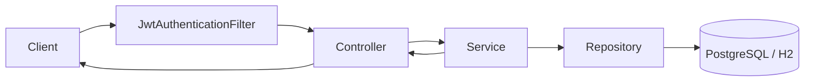

# Customer Support Hub - Architecture Overview

## 1. Purpose

Customer Support Hub is a Spring Boot backend for a multi-tenant support desk.
The system is designed to:

- authenticate users with JWT
- separate data by `organization` and `workspace`
- manage customer requests, comments, and attachments
- provide a foundation for knowledge base, AI assistant, notifications, and observability

This repo is the backend core for the JavaSpring version of the app.

## 2. Tech Stack

### Backend

- Java 21
- Spring Boot 3.3.x
- Spring Web
- Spring Security
- Spring Data JPA
- Flyway
- PostgreSQL
- H2 for local/test

### Support libraries

- JJWT for access tokens
- Spring Validation for request validation
- Spring Actuator for health and metrics
- WebSocket configuration is already available for future realtime flows

### Storage and infra

- PostgreSQL: primary data store
- Local filesystem: attachment storage in local development
- Redis: already configured for future cache and rate-limit use cases

## 3. High-level Layers

Code is organized by domain:

- `auth`: register, login, refresh, logout, me
- `organization`: company and organization management
- `workspace`: workspace within an organization
- `membership`: role assignment and team management
- `workflow`: customer request CRUD and audit events
- `comment`: request comments
- `attachment`: request file upload, download, and delete
- `knowledge`: placeholder module for knowledge base
- `notification`: placeholder module for notifications
- `ai`: placeholder module for the AI assistant
- `config`: security, OpenAPI, JPA auditing, Redis, WebSocket
- `common`: exceptions, response handling, validators, utilities

### Why this structure

Each domain keeps its controller, service, repository, entity, and DTO in one package.
That makes it easier to:

- find code by feature
- isolate tenant permissions
- write domain-focused tests
- avoid a single god module

## 4. Request Pipeline

Typical request flow:

1. Client calls the API
2. `JwtAuthenticationFilter` reads `Authorization: Bearer <token>`
3. A valid token creates `AuthenticatedUser`
4. Controller reads `currentUserId` from `Authentication`
5. Service checks tenant and role rules
6. Repository reads or writes the database
7. Controller returns the response

## 5. Authentication Model

### Endpoints

- `POST /api/auth/register`
- `POST /api/auth/login`
- `POST /api/auth/refresh`
- `POST /api/auth/logout`
- `GET /api/auth/me`

### Token strategy

- access token: `Authorization` header
- refresh token: HTTP-only cookie
- logout: revoke the refresh session and clear the cookie

### Why this design

- short-lived access token reduces risk
- HTTP-only refresh cookie keeps refresh token out of browser JS
- good fit for SPA usage
- lower exposure in the browser

## 6. Tenant Model

The tenant scope is not just the `user`.
The real scope is:

- `organization`
- `workspace`

### Core tables

- `users`
- `sessions`
- `organizations`
- `workspaces`
- `memberships`

### Isolation rule

Every business resource must be checked in the organization context.
The service layer always verifies:

- whether the user has access to the organization
- whether the user has the right role
- whether the resource belongs to the correct org/workspace

### Why this matters

If the service layer does not check tenant scope, a user could read another tenant's data by guessing an ID.
This backend uses server-enforced tenant isolation instead of relying only on the UI.

## 7. Workflow Domain

Workflow item = customer request.

### Main endpoints

- `GET /api/organizations/{orgSlug}/workflow-items`
- `GET /api/organizations/{orgSlug}/workflow-items/{workflowItemId}`
- `POST /api/organizations/{orgSlug}/workflow-items`
- `PATCH /api/organizations/{orgSlug}/workflow-items/{workflowItemId}`
- `DELETE /api/organizations/{orgSlug}/workflow-items/{workflowItemId}`
- `GET /api/organizations/{orgSlug}/workflow-items/{workflowItemId}/events`

### Data model

- title, description
- status
- priority
- assignee
- due date
- audit events

### Why the event table exists

`workflow_events` stores the request history.
That helps with:

- audit trail
- debugging
- future notification logic
- future AI summaries and timelines

## 8. Comment and Attachment Domains

### Comments

Endpoints:

- `GET /api/organizations/{orgSlug}/workflow-items/{workflowItemId}/comments`
- `POST /api/organizations/{orgSlug}/workflow-items/{workflowItemId}/comments`
- `PATCH /api/organizations/{orgSlug}/workflow-items/{workflowItemId}/comments/{commentId}`
- `DELETE /api/organizations/{orgSlug}/workflow-items/{workflowItemId}/comments/{commentId}`

### Attachments

Endpoints:

- `GET /api/organizations/{orgSlug}/workflow-items/{workflowItemId}/attachments`
- `POST /api/organizations/{orgSlug}/workflow-items/{workflowItemId}/attachments`
- `GET /api/organizations/{orgSlug}/workflow-items/{workflowItemId}/attachments/{attachmentId}/download`
- `DELETE /api/organizations/{orgSlug}/workflow-items/{workflowItemId}/attachments/{attachmentId}`

### Storage strategy

- metadata: PostgreSQL
- file bytes: local filesystem in local development
- later this can move to GCS or an S3-like storage backend without changing the API contract much

## 9. Knowledge / AI / Notification Modules

### Knowledge

`knowledge` is the workspace knowledge base module.
It is currently a placeholder for future work such as:

- markdown upload
- chunking
- embeddings and indexing
- search and citation

### AI

`ai` is the assistant/chatbot module.
It is prepared for:

- function calling
- tool registry
- tenant-scoped actions
- summarization and routing

### Notification

`notification` is the event-driven update module.
Future direction:

- request updated
- comment added
- mention or invite
- due soon

## 10. Configuration and Cross-cutting Concerns

### Security config

- stateless session
- JWT filter
- route whitelist for auth, health, and docs

### Swagger/OpenAPI

- Swagger/OpenAPI config is enabled for API discovery
- helpful for frontend integration and interviews

### JPA auditing

- entities auto-fill `createdAt` and `updatedAt`

### Validation

- request DTOs use Bean Validation
- reduces the risk of empty or malformed payloads

### Local setup

- local DB can use H2 if env vars are not set
- local attachments are stored in `./data/attachments`
- `data/` is ignored by git

## 11. Deployment direction

### Local

- H2 for local fallback
- PostgreSQL for the real Docker Compose setup
- attachments stored locally

### Future production

- PostgreSQL in managed infrastructure
- attachment storage moved to GCS or another object store

## 12. Interview summary

If someone asks "why this architecture?", the short answer is:

- package-by-domain keeps responsibilities clear
- JWT stateless auth works well for API and SPA usage
- HTTP-only refresh cookie reduces refresh token exposure
- organization/workspace/membership creates multi-tenant isolation
- workflow events provide audit and future automation
- attachment metadata is separated from file storage so the storage backend can change later

