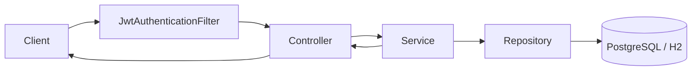

# Customer Support Hub - Architecture Overview

## 1. Purpose

Customer Support Hub là một backend Spring Boot cho bài toán support desk đa tenant.
Mục tiêu của hệ thống là:

- xác thực người dùng bằng JWT
- tách dữ liệu theo `organization` và `workspace`
- quản lý customer requests, comments, attachments
- có nền cho knowledge base, AI assistant, notifications và observability

Repo này đang đóng vai trò backend chính cho app JavaSpring.

## 2. Tech Stack

### Backend

- Java 21
- Spring Boot 3.3.x
- Spring Web
- Spring Security
- Spring Data JPA
- Flyway
- PostgreSQL
- H2 cho local/test

### Support libraries

- JJWT cho access token
- Spring Validation cho validate request
- Spring Actuator cho health/metrics
- WebSocket config đã có sẵn cho các flow realtime về sau

### Storage and infra

- PostgreSQL: lưu data chính
- Local filesystem: lưu attachment khi chạy local
- Redis: đã có config nền cho các flow cần cache/rate limit

## 3. High-level Layers

Code được chia theo từng domain:

- `auth`: register/login/refresh/logout/me
- `organization`: company/org management
- `workspace`: workspace within an org
- `membership`: role assignment and team management
- `workflow`: customer request CRUD and audit events
- `comment`: request comments
- `attachment`: request file upload/download/delete
- `knowledge`: placeholder module cho knowledge base
- `notification`: placeholder module cho notifications
- `ai`: placeholder module cho AI assistant
- `config`: security, OpenAPI, JPA auditing, Redis, WebSocket
- `common`: exception, response, validator, util

### Why this structure

Mỗi domain giữ đủ controller/service/repository/entity/dto ngay trong package của nó.
Điều này giúp:

- dễ tìm code theo feature
- dễ tách permission theo tenant
- dễ viết test theo từng domain
- tránh “god module” chứa mọi thứ

## 4. Request Pipeline

Luồng request chung:

1. Client gọi API
2. `JwtAuthenticationFilter` đọc `Authorization: Bearer <token>`
3. Token hợp lệ thì tạo `AuthenticatedUser`
4. Controller lấy `currentUserId` từ `Authentication`
5. Service kiểm tra tenant/role rồi xử lý business
6. Repository đọc/ghi database
7. Response trả về controller

## 5. Authentication Model

### Endpoints

- `POST /api/auth/register`
- `POST /api/auth/login`
- `POST /api/auth/refresh`
- `POST /api/auth/logout`
- `GET /api/auth/me`

### Token strategy

- access token: nằm trong `Authorization` header
- refresh token: nằm trong HTTP-only cookie
- logout: revoke refresh session và clear cookie

### Why this design

- access token ngắn hạn để giảm rủi ro
- refresh cookie HTTP-only để frontend không phải tự quản lý refresh token bằng JS
- dễ support SPA và giảm exposure của token trên browser

## 6. Tenant Model

Tenant scope của hệ thống không chỉ là `user`.
Scope chính là:

- `organization`
- `workspace`

### Core tables

- `users`
- `refresh_sessions`
- `organizations`
- `workspaces`
- `memberships`

### Isolation rule

Mọi resource business đều phải đi qua organization context.
Service layer luôn check:

- user có access organization hay không
- user có role phù hợp hay không
- resource có thuộc đúng org/workspace không

### Why this matters

Nếu không check ở service layer, user có thể đọc chéo tenant bằng cách đoán ID.
Backend này chọn “server-enforced tenant isolation” thay vì chỉ dựa vào UI ẩn nút.

## 7. Workflow Domain

Workflow item là customer request.

### Main endpoints

- `GET /api/organizations/{orgSlug}/workflow-items`
- `GET /api/organizations/{orgSlug}/workflow-items/{workflowItemId}`
- `POST /api/organizations/{orgSlug}/workflow-items`
- `PATCH /api/organizations/{orgSlug}/workflow-items/{workflowItemId}`
- `DELETE /api/organizations/{orgSlug}/workflow-items/{workflowItemId}`
- `GET /api/organizations/{orgSlug}/workflow-items/{workflowItemId}/events`

### Data model

- title, description
- status
- priority
- assignee
- due date
- audit events

### Why event table exists

`workflow_events` giữ lịch sử trạng thái thay đổi.
Điều này giúp:

- audit trail
- debugging
- future notification logic
- future AI summaries / timeline

## 8. Comment and Attachment Domains

### Comments

Endpoints:

- `GET /api/organizations/{orgSlug}/workflow-items/{workflowItemId}/comments`
- `POST /api/organizations/{orgSlug}/workflow-items/{workflowItemId}/comments`
- `PATCH /api/organizations/{orgSlug}/workflow-items/{workflowItemId}/comments/{commentId}`
- `DELETE /api/organizations/{orgSlug}/workflow-items/{workflowItemId}/comments/{commentId}`

### Attachments

Endpoints:

- `GET /api/organizations/{orgSlug}/workflow-items/{workflowItemId}/attachments`
- `POST /api/organizations/{orgSlug}/workflow-items/{workflowItemId}/attachments`
- `GET /api/organizations/{orgSlug}/workflow-items/{workflowItemId}/attachments/{attachmentId}/download`
- `DELETE /api/organizations/{orgSlug}/workflow-items/{workflowItemId}/attachments/{attachmentId}`

### Storage strategy

- metadata: PostgreSQL
- file content: local filesystem khi chạy local
- later có thể đổi sang GCS / S3 style storage mà không đổi API contract nhiều

## 9. Knowledge / AI / Notification Modules

### Knowledge

`knowledge` là module cho workspace knowledge base.
Hiện tại module này đang là placeholder để sau này:

- upload markdown
- chunk content
- index embeddings
- search/citation

### AI

`ai` là module cho assistant/chatbot.
Nó chuẩn bị cho:

- function calling
- tool registry
- tenant-scoped actions
- summarization / routing / request lookup

### Notification

`notification` là module cho event-driven updates.
Hướng đi tương lai:

- request updated
- comment added
- mention / invite / due soon

## 10. Configuration and Cross-cutting Concerns

### Security config

- stateless session
- JWT filter
- route whitelist cho auth/health/docs

### OpenAPI

- Swagger/OpenAPI config đã bật sẵn để khám phá API

### JPA auditing

- tự gắn createdAt/updatedAt ở entity

### Validation

- DTO request dùng Bean Validation
- giảm risk nhận payload rỗng hoặc sai format

## 11. Current Runtime Notes

### Local

- DB local dùng H2 mặc định nếu chưa set env
- attachment local lưu vào `./data/attachments`
- `data/` đã được ignore để không dính vào git

### Production path

- PostgreSQL thật
- attachment storage có thể nâng lên GCS
- Redis cho cache/rate limit
- observability qua Actuator / metrics / logs / dashboard

## 12. Interview Cheatsheet

Nếu bị hỏi “tại sao kiến trúc này”:

- package-by-domain giúp tách responsibility rõ
- JWT stateless phù hợp API/SPA
- refresh cookie HTTP-only giảm exposure của refresh token
- organization/workspace/membership tạo multi-tenant isolation
- workflow events giúp audit và future automation
- attachment metadata tách khỏi file storage để dễ đổi storage backend

