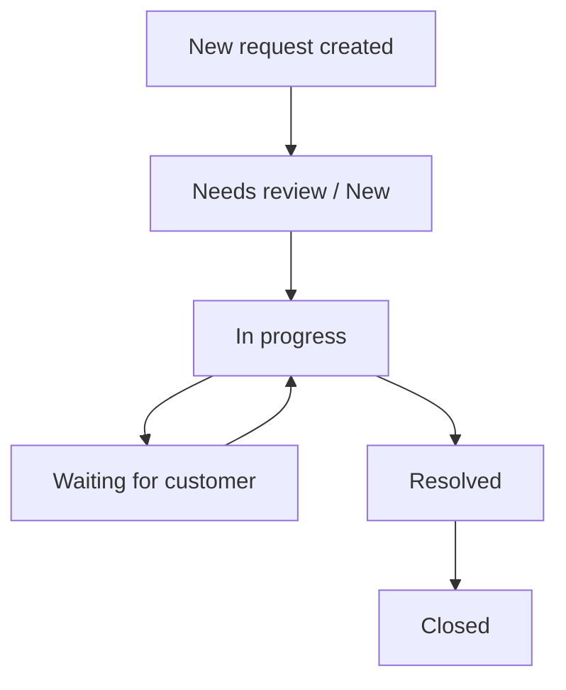

# Customer Support Hub - Business Flow and API Map

## 1. Product Story

Customer Support Hub là một support desk đa tenant.
Một company/organization sẽ có:

- owner
- admin
- member
- viewer

Mỗi organization có thể có nhiều workspace, và workflow items được quản lý theo org/workspace scope.

## 2. Main Business Flow

### Flow A: Register and Login

1. User đăng ký hoặc login
2. Backend tạo access token
3. Backend set refresh token trong HTTP-only cookie
4. Client dùng access token để gọi API tiếp
5. Khi access token hết hạn thì gọi refresh

### Flow B: Create Organization

1. Owner tạo organization
2. System tự tạo workspace mặc định `General`
3. System tạo membership owner
4. User vào dashboard của organization đó

### Flow C: Invite Team Members

1. Owner/Admin mở trang team
2. Nhập email + role
3. Backend tạo membership/invitation logic theo org
4. Người được mời join vào workspace/company

### Flow D: Create and Manage Customer Requests

1. Member/Admin/Owner tạo workflow item
2. Item đi vào đúng organization/workspace
3. Người có quyền update status/priority/assignee
4. Comments và attachments bám vào đúng request
5. Audit event được lưu cho create/update/delete

### Flow E: Knowledge Base

1. Owner/Admin upload markdown document
2. Document được chia chunk
3. Chunk được index
4. AI assistant tìm source liên quan rồi trả lời có citation

### Flow F: AI Assistant

1. User mở assistant panel
2. User hỏi về request/queue/knowledge
3. AI chọn tool phù hợp
4. Tool chỉ được phép chạm vào data trong tenant hiện tại
5. Nếu cần, AI trả lời kèm source hoặc navigate action

## 3. API Map

### Auth

- `POST /api/auth/register`
- `POST /api/auth/login`
- `POST /api/auth/refresh`
- `POST /api/auth/logout`
- `GET /api/auth/me`

### Organizations

- `GET /api/organizations`
- `POST /api/organizations`
- `GET /api/organizations/{slug}`

### Workspaces

- `GET /api/organizations/{orgSlug}/workspaces`
- `POST /api/organizations/{orgSlug}/workspaces`

### Memberships / Team

- `GET /api/organizations/{orgSlug}/memberships`
- `POST /api/organizations/{orgSlug}/memberships`
- `PATCH /api/organizations/{orgSlug}/memberships/{membershipId}/role/{role}`
- `DELETE /api/organizations/{orgSlug}/memberships/{membershipId}`

### Workflow Items

- `GET /api/organizations/{orgSlug}/workflow-items`
- `GET /api/organizations/{orgSlug}/workflow-items/{workflowItemId}`
- `POST /api/organizations/{orgSlug}/workflow-items`
- `PATCH /api/organizations/{orgSlug}/workflow-items/{workflowItemId}`
- `DELETE /api/organizations/{orgSlug}/workflow-items/{workflowItemId}`
- `GET /api/organizations/{orgSlug}/workflow-items/{workflowItemId}/events`

### Comments

- `GET /api/organizations/{orgSlug}/workflow-items/{workflowItemId}/comments`
- `POST /api/organizations/{orgSlug}/workflow-items/{workflowItemId}/comments`
- `PATCH /api/organizations/{orgSlug}/workflow-items/{workflowItemId}/comments/{commentId}`
- `DELETE /api/organizations/{orgSlug}/workflow-items/{workflowItemId}/comments/{commentId}`

### Attachments

- `GET /api/organizations/{orgSlug}/workflow-items/{workflowItemId}/attachments`
- `POST /api/organizations/{orgSlug}/workflow-items/{workflowItemId}/attachments`
- `GET /api/organizations/{orgSlug}/workflow-items/{workflowItemId}/attachments/{attachmentId}/download`
- `DELETE /api/organizations/{orgSlug}/workflow-items/{workflowItemId}/attachments/{attachmentId}`

### Knowledge / AI / Notifications

- `GET/POST /api/knowledge` family: module shell, future knowledge flows
- `GET/POST /api/ai` family: module shell, future assistant flows
- `GET/POST /api/notifications` family: module shell, future notification flows

## 4. Role Matrix

### Owner

- full company/workspace control
- manage team
- manage workflow
- manage knowledge

### Admin

- manage team member/viewer
- manage requests
- manage knowledge

### Member

- create/update requests
- comment
- upload attachments
- view knowledge depending on rules

### Viewer

- read-only
- cannot mutate requests/comments/attachments

## 5. Request Lifecycle

### Meaning of status

- `NEW`: vừa tạo
- `TRIAGE` / `NEEDS_REVIEW`: cần phân loại
- `IN_PROGRESS`: đang xử lý
- `WAITING_FOR_CUSTOMER`: chờ khách phản hồi
- `RESOLVED`: đã xong nhưng có thể chờ confirm
- `CLOSED`: đóng hẳn

## 6. Permission Rules That Matter

### Tenant isolation

- user chỉ thấy organization mà họ có access
- request/comment/attachment luôn check theo `orgSlug` + resource id
- không dựa vào UI để bảo mật

### Write permissions

- owner/admin/member có thể mutate workflow/comment/attachment
- viewer không được mutate

### Assignee rules

- assignee phải tồn tại
- assignee phải thuộc đúng organization

## 7. Data Flow by Feature

### Create request

1. UI gửi `POST /workflow-items`
2. Backend resolve organization
3. Backend resolve workspace `general` nếu không truyền
4. Backend validate permission
5. Backend lưu request
6. Backend ghi event `CREATED`

### Update request

1. UI gửi `PATCH /workflow-items/{id}`
2. Backend load request theo org
3. Backend snapshot before/after
4. Backend update field hợp lệ
5. Backend validate assignee nếu có
6. Backend ghi event `UPDATED`

### Comment

1. UI gửi comment
2. Backend resolve đúng request trong đúng org
3. Backend validate write access
4. Backend save comment

### Attachment

1. UI chọn file
2. Backend validate size/type
3. File content lưu local filesystem
4. Metadata lưu DB
5. Download trả đúng filename/content-type

## 8. Where the code lives

### Auth

- Controller: `src/main/java/com/nhat/workflowhub/auth/controller`
- Service: `src/main/java/com/nhat/workflowhub/auth/service`
- Security: `src/main/java/com/nhat/workflowhub/auth/security`

### Organization / Workspace / Membership

- `src/main/java/com/nhat/workflowhub/organization`
- `src/main/java/com/nhat/workflowhub/workspace`
- `src/main/java/com/nhat/workflowhub/membership`

### Workflow / Comment / Attachment

- `src/main/java/com/nhat/workflowhub/workflow`
- `src/main/java/com/nhat/workflowhub/comment`
- `src/main/java/com/nhat/workflowhub/attachment`

### Shared code

- `src/main/java/com/nhat/workflowhub/common`
- `src/main/java/com/nhat/workflowhub/config`

## 9. What is still scaffold / future work

### Knowledge

Hiện `knowledge` mới là module shell.
Khi làm tiếp, nó sẽ cần:

- document upload
- chunking
- embeddings/index
- source citation

### AI

Hiện `ai` mới là shell.
Khi làm tiếp, nó sẽ cần:

- tool calling
- route hỏi đáp
- tenant-safe data access
- prompt injection guardrails

### Notifications

Hiện `notification` cũng mới là shell.
Khi làm tiếp, nó sẽ cần:

- event on request/comment/member actions
- unread/read state
- UI badge / panel

## 10. Interview Summary

Nếu phải mô tả ngắn gọn:

> Đây là một backend Spring Boot đa tenant cho support desk.  
> Auth dùng JWT + refresh cookie.  
> Mọi business data đều bị khóa theo organization/workspace/membership.  
> Workflow item có audit event, comment và attachment riêng.  
> Knowledge, AI, Notification đã có shell để mở rộng.

