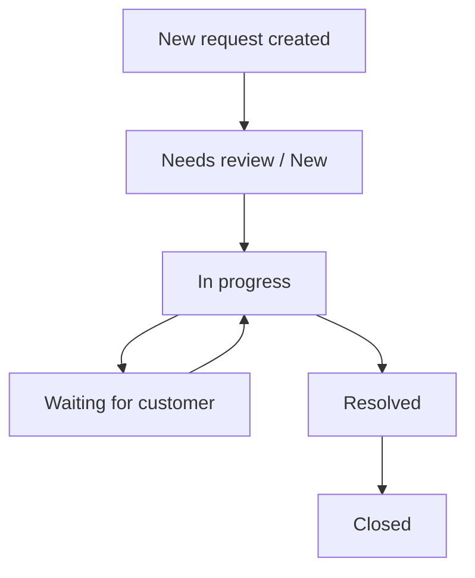

# Customer Support Hub - Business Flow and API Map

## 1. Product Story

Customer Support Hub is a multi-tenant support desk.
Each company or organization has:

- owner
- admin
- member
- viewer

An organization can have multiple workspaces, and workflow items are managed within an organization/workspace scope.

## 2. Main Business Flow

### Flow A: Register and Login

1. A user registers or logs in
2. The backend creates an access token
3. The backend sets a refresh token in an HTTP-only cookie
4. The client uses the access token for subsequent API calls
5. When the access token expires, the client calls refresh

### Flow B: Create Organization

1. The owner creates an organization
2. The system automatically creates the default `General` workspace
3. The system creates the owner membership
4. The user enters the dashboard for that organization

### Flow C: Invite Team Members

1. Owner or admin opens the team page
2. Enters email and role
3. The backend creates membership or invitation logic for the organization
4. The invited user joins the workspace or company

### Flow D: Create and Manage Customer Requests

1. Member, admin, or owner creates a workflow item
2. The item belongs to the correct organization and workspace
3. Authorized users update status, priority, or assignee
4. Comments and attachments are linked to the request
5. Audit events are stored for create, update, and delete actions

### Flow E: Knowledge Base

1. Owner or admin uploads a markdown document
2. The document is split into chunks
3. The chunks are indexed
4. The AI assistant finds the relevant source and answers with citation

### Flow F: AI Assistant

1. A user opens the assistant panel
2. The user asks about requests, queue state, or knowledge
3. The AI selects the right tool
4. The tool can only access data in the current tenant
5. If needed, the AI returns a source citation or a navigation action

## 3. API Map

### Auth

- `POST /api/auth/register`
- `POST /api/auth/login`
- `POST /api/auth/refresh`
- `POST /api/auth/logout`
- `GET /api/auth/me`

### Organizations

- `GET /api/organizations`
- `POST /api/organizations`
- `GET /api/organizations/{slug}`

### Workspaces

- `GET /api/organizations/{orgSlug}/workspaces`
- `POST /api/organizations/{orgSlug}/workspaces`

### Memberships / Team

- `GET /api/organizations/{orgSlug}/memberships`
- `POST /api/organizations/{orgSlug}/memberships`
- `PATCH /api/organizations/{orgSlug}/memberships/{membershipId}/role/{role}`
- `DELETE /api/organizations/{orgSlug}/memberships/{membershipId}`

### Workflow Items

- `GET /api/organizations/{orgSlug}/workflow-items`
- `GET /api/organizations/{orgSlug}/workflow-items/{workflowItemId}`
- `POST /api/organizations/{orgSlug}/workflow-items`
- `PATCH /api/organizations/{orgSlug}/workflow-items/{workflowItemId}`
- `DELETE /api/organizations/{orgSlug}/workflow-items/{workflowItemId}`
- `GET /api/organizations/{orgSlug}/workflow-items/{workflowItemId}/events`

### Comments

- `GET /api/organizations/{orgSlug}/workflow-items/{workflowItemId}/comments`
- `POST /api/organizations/{orgSlug}/workflow-items/{workflowItemId}/comments`
- `PATCH /api/organizations/{orgSlug}/workflow-items/{workflowItemId}/comments/{commentId}`
- `DELETE /api/organizations/{orgSlug}/workflow-items/{workflowItemId}/comments/{commentId}`

### Attachments

- `GET /api/organizations/{orgSlug}/workflow-items/{workflowItemId}/attachments`
- `POST /api/organizations/{orgSlug}/workflow-items/{workflowItemId}/attachments`
- `GET /api/organizations/{orgSlug}/workflow-items/{workflowItemId}/attachments/{attachmentId}/download`
- `DELETE /api/organizations/{orgSlug}/workflow-items/{workflowItemId}/attachments/{attachmentId}`

### Knowledge / AI / Notifications

- `GET/POST /api/knowledge` family: module shell, future knowledge flows
- `GET/POST /api/ai` family: module shell, future assistant flows
- `GET/POST /api/notifications` family: module shell, future notification flows

## 4. Role Matrix

### Owner

- full company and workspace control
- team management
- workflow management
- knowledge management

### Admin

- manage team members and viewers
- manage requests
- manage knowledge

### Member

- create and update requests
- comment
- upload attachments
- view knowledge depending on rules

### Viewer

- read-only
- cannot mutate requests, comments, or attachments

## 5. Request Lifecycle

### Meaning of status

- `NEW`: just created
- `TRIAGE` or `NEEDS_REVIEW`: needs classification
- `IN_PROGRESS`: currently being handled
- `WAITING_FOR_CUSTOMER`: waiting for the customer to respond
- `RESOLVED`: completed but may still wait for confirmation
- `CLOSED`: fully closed

## 6. Permission Rules That Matter

### Tenant isolation

- users can only see organizations they have access to
- requests, comments, and attachments are always checked using `orgSlug` plus resource ID
- security is not based on UI hiding alone

### Write permissions

- owner, admin, and member can mutate workflow, comment, and attachment data
- viewer cannot mutate

### Assignee rules

- assignee must exist
- assignee must belong to the correct organization

## 7. Data Flow by Feature

### Create request

1. UI sends `POST /workflow-items`
2. Backend resolves the organization
3. Backend resolves the `general` workspace if none is provided
4. Backend validates permissions
5. Backend saves the request
6. Backend writes a `CREATED` event

### Update request

1. UI sends `PATCH /workflow-items/{id}`
2. Backend loads the request within the organization
3. Backend snapshots before and after values
4. Backend updates allowed fields
5. Backend validates assignee if present
6. Backend writes an `UPDATED` event

### Comment

1. UI sends a comment
2. Backend resolves the correct request within the correct organization
3. Backend validates write access
4. Backend saves the comment

### Attachment

1. UI selects a file
2. Backend validates file size and type
3. File content is stored in the local filesystem
4. Metadata is stored in the database
5. Download returns the correct file name and content type

## 8. Where the code lives

### Auth

- Controller: `src/main/java/com/nhat/workflowhub/auth/controller`
- Service: `src/main/java/com/nhat/workflowhub/auth/service`
- Security: `src/main/java/com/nhat/workflowhub/auth/security`

### Organization / Workspace / Membership

- `src/main/java/com/nhat/workflowhub/organization`
- `src/main/java/com/nhat/workflowhub/workspace`
- `src/main/java/com/nhat/workflowhub/membership`

### Workflow / Comment / Attachment

- `src/main/java/com/nhat/workflowhub/workflow`
- `src/main/java/com/nhat/workflowhub/comment`
- `src/main/java/com/nhat/workflowhub/attachment`

### Shared code

- `src/main/java/com/nhat/workflowhub/common`
- `src/main/java/com/nhat/workflowhub/config`

## 9. What is still scaffold / future work

### Knowledge

`knowledge` is currently only a shell module.
Future work will need:

- document upload
- chunking
- embeddings and indexing
- source citation

### AI

`ai` is currently only a shell module.
Future work will need:

- tool routing
- request lookup
- tenant-safe function calling

### Notification

`notification` is currently only a shell module.
Future work will need:

- request status updates
- mention or invite events
- unread badge handling

## 10. Short interview answer

If you need to describe the backend quickly:

> This is a multi-tenant Spring Boot backend for a support desk.  
> Auth uses JWT plus a refresh cookie.  
> All business data is locked by organization, workspace, and membership scope.  
> Workflow items have audit events, comments, and attachments.  
> Knowledge, AI, and notification already have shells for future expansion.

