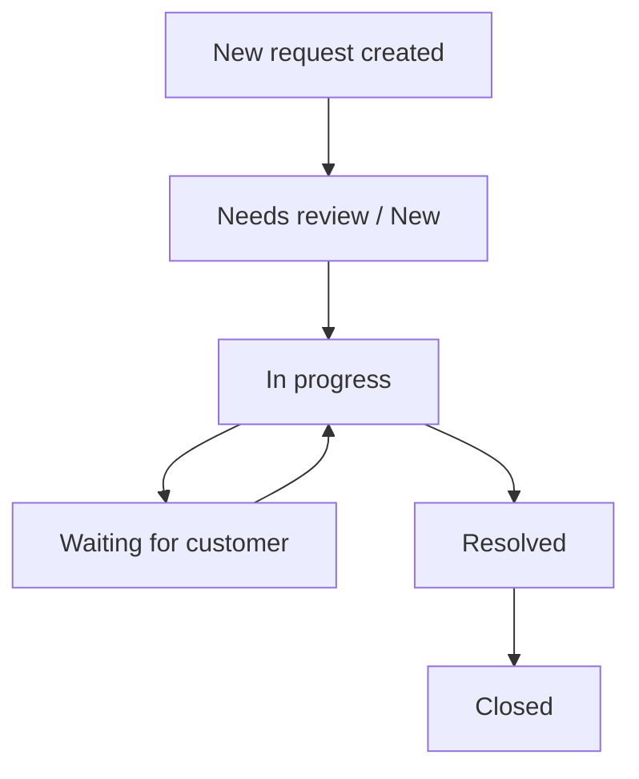

# Customer Support Hub - Business Flow and API Map

## 1. Product story

Customer Support Hub is a multi-tenant support desk.
A company or organization has:

- owner
- admin
- member
- viewer

Each organization can have multiple workspaces, and workflow items are managed at the organization and workspace scope.

## 2. Main business flows

### Flow A: Register and login

1. The user registers or logs in.
2. The backend creates an access token.
3. The backend sets the refresh token in an HTTP-only cookie.
4. The client uses the access token for subsequent API calls.
5. When the access token expires, the client calls refresh.

### Flow B: Create organization

1. The owner creates an organization.
2. The system creates the default workspace `General`.
3. The system creates the owner membership.
4. The user enters the dashboard for that organization.

### Flow C: Invite team members

1. The owner or admin opens the team page.
2. They enter an email and a role.
3. The backend creates membership or invitation logic for the organization.
4. The invited user joins the company or workspace.

### Flow D: Create and manage customer requests

1. A member, admin, or owner creates a workflow item.
2. The item is stored in the correct organization and workspace.
3. Authorized users update the status, priority, and assignee.
4. Comments and attachments belong to the correct request.
5. Audit events are stored for create, update, and delete actions.

### Flow E: Knowledge base

1. The owner or admin uploads a Markdown document.
2. The document is split into chunks.
3. The chunks are indexed.
4. The AI assistant finds relevant sources and answers with citations.

### Flow F: AI assistant

1. The user opens the assistant panel.
2. The user asks about requests, queues, or knowledge.
3. The AI selects the right tool.
4. The tool can only access data in the current tenant.
5. If needed, the AI replies with a source or a navigation action.

## 3. API map

### Auth

- `POST /api/auth/register`
- `POST /api/auth/login`
- `POST /api/auth/refresh`
- `POST /api/auth/logout`
- `GET /api/auth/me`

### Organizations

- `GET /api/organizations`
- `POST /api/organizations`
- `GET /api/organizations/{slug}`

### Workspaces

- `GET /api/organizations/{orgSlug}/workspaces`
- `POST /api/organizations/{orgSlug}/workspaces`

### Memberships and team

- `GET /api/organizations/{orgSlug}/memberships`
- `POST /api/organizations/{orgSlug}/memberships`
- `PATCH /api/organizations/{orgSlug}/memberships/{membershipId}/role/{role}`
- `DELETE /api/organizations/{orgSlug}/memberships/{membershipId}`

### Workflow items

- `GET /api/organizations/{orgSlug}/workflow-items`
- `GET /api/organizations/{orgSlug}/workflow-items/{workflowItemId}`
- `POST /api/organizations/{orgSlug}/workflow-items`
- `PATCH /api/organizations/{orgSlug}/workflow-items/{workflowItemId}`
- `DELETE /api/organizations/{orgSlug}/workflow-items/{workflowItemId}`
- `GET /api/organizations/{orgSlug}/workflow-items/{workflowItemId}/events`

### Comments

- `GET /api/organizations/{orgSlug}/workflow-items/{workflowItemId}/comments`
- `POST /api/organizations/{orgSlug}/workflow-items/{workflowItemId}/comments`
- `PATCH /api/organizations/{orgSlug}/workflow-items/{workflowItemId}/comments/{commentId}`
- `DELETE /api/organizations/{orgSlug}/workflow-items/{workflowItemId}/comments/{commentId}`

### Attachments

- `GET /api/organizations/{orgSlug}/workflow-items/{workflowItemId}/attachments`
- `POST /api/organizations/{orgSlug}/workflow-items/{workflowItemId}/attachments`
- `GET /api/organizations/{orgSlug}/workflow-items/{workflowItemId}/attachments/{attachmentId}/download`
- `DELETE /api/organizations/{orgSlug}/workflow-items/{workflowItemId}/attachments/{attachmentId}`

### Knowledge, AI, and notifications

- `GET/POST` knowledge family: module shell for future knowledge flows
- `GET/POST` AI family: module shell for future assistant flows
- `GET/POST` notifications family: module shell for future notification flows

## 4. Role matrix

### Owner

- full company and workspace control
- manage team
- manage workflow
- manage knowledge

### Admin

- manage team members and viewers
- manage requests
- manage knowledge

### Member

- create and update requests
- comment
- upload attachments
- view knowledge according to rules

### Viewer

- read-only
- cannot mutate requests, comments, or attachments

## 5. Request lifecycle

### Status meaning

- `NEW`: just created
- `TRIAGE` / `NEEDS_REVIEW`: needs classification
- `IN_PROGRESS`: actively being worked on
- `WAITING_FOR_CUSTOMER`: waiting for customer response
- `RESOLVED`: finished but may still wait for confirmation
- `CLOSED`: fully closed

## 6. Permission rules that matter

### Tenant isolation

- users only see organizations they can access
- requests, comments, and attachments are always checked by `orgSlug` plus resource ID
- the UI is not the security boundary

### Write permissions

- owner, admin, and member can mutate workflow items, comments, and attachments
- viewer cannot mutate

### Assignee rules

- the assignee must exist
- the assignee must belong to the correct organization

## 7. Data flow by feature

### Create request

1. The UI sends `POST /workflow-items`
2. The backend resolves the organization
3. The backend resolves the `general` workspace if none is provided
4. The backend validates permissions
5. The backend saves the request
6. The backend writes a `CREATED` event

### Update request

1. The UI sends `PATCH /workflow-items/{id}`
2. The backend loads the request by organization
3. The backend snapshots the before and after state
4. The backend updates the allowed fields
5. The backend validates the assignee if needed
6. The backend writes an `UPDATED` event

### Comment

1. The UI sends a comment
2. The backend resolves the correct request in the correct organization
3. The backend validates write access
4. The backend saves the comment

### Attachment

1. The UI selects a file
2. The backend validates the size and type
3. The file content is stored in the local filesystem
4. The metadata is stored in the database
5. Downloads return the correct filename and content type

## 8. Where the code lives

### Auth

- Controller: `src/main/java/com/nhat/workflowhub/auth/controller`
- Service: `src/main/java/com/nhat/workflowhub/auth/service`
- Security: `src/main/java/com/nhat/workflowhub/auth/security`

### Organization, workspace, and membership

- `src/main/java/com/nhat/workflowhub/organization`
- `src/main/java/com/nhat/workflowhub/workspace`
- `src/main/java/com/nhat/workflowhub/membership`

### Workflow, comment, and attachment

- `src/main/java/com/nhat/workflowhub/workflow`
- `src/main/java/com/nhat/workflowhub/comment`
- `src/main/java/com/nhat/workflowhub/attachment`

### Shared code

- `src/main/java/com/nhat/workflowhub/common`
- `src/main/java/com/nhat/workflowhub/config`

## 9. What is still scaffolded or future work

### Knowledge

The `knowledge` module is currently a shell.
The next implementation steps are:

- document upload
- chunking
- embeddings and indexing
- source citation

### AI

The `ai` module is currently a shell.
The next implementation steps are:

- tool calling
- question routing
- tenant-safe data access
- prompt injection guardrails

### Notifications

The `notification` module is currently a shell.
The next implementation steps are:

- events on request, comment, and member actions
- unread and read state
- UI badge and panel support

## 10. Interview summary

If you need a short explanation:

> This is a multi-tenant Spring Boot backend for a support desk.  
> Auth uses JWT plus a refresh cookie.  
> All business data is locked by organization, workspace, and membership scope.  
> Workflow items have audit events, comments, and attachments.  
> Knowledge, AI, and Notification already have shells for future expansion.
