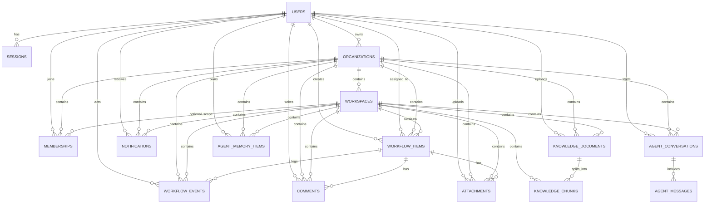

# Database Schema

Tài liệu này mô tả schema PostgreSQL hiện tại của `customer-support` và chỉ rõ file code nào đang map vào từng bảng.

## Source of truth

- Schema gốc: [`src/main/resources/db/migration/V1__baseline.sql`](../src/main/resources/db/migration/V1__baseline.sql)
- JPA entity:
  - [`src/main/java/com/nhat/workflowhub/auth/entity/UserAccount.java`](../src/main/java/com/nhat/workflowhub/auth/entity/UserAccount.java)
  - [`src/main/java/com/nhat/workflowhub/auth/entity/RefreshSession.java`](../src/main/java/com/nhat/workflowhub/auth/entity/RefreshSession.java)
  - [`src/main/java/com/nhat/workflowhub/organization/entity/Organization.java`](../src/main/java/com/nhat/workflowhub/organization/entity/Organization.java)
  - [`src/main/java/com/nhat/workflowhub/workspace/entity/Workspace.java`](../src/main/java/com/nhat/workflowhub/workspace/entity/Workspace.java)
  - [`src/main/java/com/nhat/workflowhub/membership/entity/Membership.java`](../src/main/java/com/nhat/workflowhub/membership/entity/Membership.java)
  - [`src/main/java/com/nhat/workflowhub/workflow/entity/WorkflowItem.java`](../src/main/java/com/nhat/workflowhub/workflow/entity/WorkflowItem.java)
  - [`src/main/java/com/nhat/workflowhub/workflow/entity/WorkflowEvent.java`](../src/main/java/com/nhat/workflowhub/workflow/entity/WorkflowEvent.java)
  - [`src/main/java/com/nhat/workflowhub/comment/entity/Comment.java`](../src/main/java/com/nhat/workflowhub/comment/entity/Comment.java)
  - [`src/main/java/com/nhat/workflowhub/attachment/entity/Attachment.java`](../src/main/java/com/nhat/workflowhub/attachment/entity/Attachment.java)

### Tables currently modeled in SQL but not yet fully mapped by JPA

- `notifications`
- `knowledge_documents`
- `knowledge_chunks`
- `agent_conversations`
- `agent_messages`
- `agent_memory_items`

The Java side already has placeholder controllers for these areas:

- [`src/main/java/com/nhat/workflowhub/notification/controller/NotificationController.java`](../src/main/java/com/nhat/workflowhub/notification/controller/NotificationController.java)
- [`src/main/java/com/nhat/workflowhub/knowledge/controller/KnowledgeController.java`](../src/main/java/com/nhat/workflowhub/knowledge/controller/KnowledgeController.java)
- [`src/main/java/com/nhat/workflowhub/ai/controller/AiController.java`](../src/main/java/com/nhat/workflowhub/ai/controller/AiController.java)

## High-level model

The database is organized around five layers:

1. Identity and auth
2. Organization and workspace tenancy
3. Support workflow data
4. Knowledge / AI supporting data
5. Notifications and audit-style history

All tenant-facing tables carry `organization_id` and most tenant-scoped tables also carry `workspace_id` to keep data isolated.

## ERD

## Table details

### 1) `users`

**Code**

- SQL: `V1__baseline.sql`
- JPA: [`UserAccount.java`](../src/main/java/com/nhat/workflowhub/auth/entity/UserAccount.java)

**Purpose**

Stores application users.

**Columns**

- `id uuid PK`  
  Primary key.
- `email varchar(255) unique not null`  
  Login email.
- `password_hash varchar(255) not null`  
  BCrypt/hashed password, never plaintext.
- `full_name varchar(255) not null`  
  Display name.
- `status varchar(32) not null`  
  Maps to `UserStatus`:
  - `ACTIVE`
  - `DISABLED`
  - `PENDING`
- `created_at timestamp not null`
- `updated_at timestamp not null`

**Relationships**

- One user can own organizations.
- One user can have many memberships.
- One user can have many sessions.
- One user can create/own workflow items, comments, attachments, knowledge docs, conversations, and memories.

---

### 2) `organizations`

**Code**

- SQL: `V1__baseline.sql`
- JPA: [`Organization.java`](../src/main/java/com/nhat/workflowhub/organization/entity/Organization.java)

**Purpose**

Top-level tenant boundary. In the UI this is the company/workspace owner layer.

**Columns**

- `id uuid PK`
- `name varchar(255) not null`
- `slug varchar(255) unique not null`
- `owner_user_id uuid not null FK -> users.id`
- `created_at timestamp not null`
- `updated_at timestamp not null`

**Relationships**

- One organization has many workspaces.
- One organization has many memberships.
- One organization scopes workflow data, comments, attachments, notifications, knowledge, and agent data.

**Code note**

- `Organization.java` auto-generates `id`, `createdAt`, and `updatedAt` using `@PrePersist` / `@PreUpdate`.

---

### 3) `workspaces`

**Code**

- SQL: `V1__baseline.sql`
- JPA: [`Workspace.java`](../src/main/java/com/nhat/workflowhub/workspace/entity/Workspace.java)

**Purpose**

Second-level tenant slice inside one organization.

**Columns**

- `id uuid PK`
- `organization_id uuid not null FK -> organizations.id on delete cascade`
- `name varchar(255) not null`
- `slug varchar(255) not null`
- `created_at timestamp not null`
- `updated_at timestamp not null`
- unique `(organization_id, slug)`

**Relationships**

- One workspace belongs to exactly one organization.
- Many workflow items, comments, attachments, knowledge docs, notifications, conversations, and memories belong to a workspace.
- Membership can optionally be workspace-scoped via `workspace_id`.

**Code note**

- `Workspace.java` also auto-generates timestamps similarly to organization.

---

### 4) `memberships`

**Code**

- SQL: `V1__baseline.sql`
- JPA: [`Membership.java`](../src/main/java/com/nhat/workflowhub/membership/entity/Membership.java)

**Purpose**

Defines what role a user has in a tenant scope.

**Columns**

- `id uuid PK`
- `organization_id uuid not null FK -> organizations.id on delete cascade`
- `workspace_id uuid null FK -> workspaces.id on delete cascade`
- `user_id uuid not null FK -> users.id on delete cascade`
- `role varchar(32) not null`
  - Maps to `UserRole`:
    - `OWNER`
    - `ADMIN`
    - `MEMBER`
    - `VIEWER`
- `created_at timestamp not null`
- `updated_at timestamp not null`
- unique `(organization_id, workspace_id, user_id)`

**How to read `workspace_id`**

- If `workspace_id` is `null`, the membership is organization-wide.
- If `workspace_id` has a value, the membership is scoped to that workspace.

**Code note**

- `Membership.java` maps `role` to `UserRole` enum with `EnumType.STRING`.

---

### 5) `sessions`

**Code**

- SQL: `V1__baseline.sql`
- JPA: [`RefreshSession.java`](../src/main/java/com/nhat/workflowhub/auth/entity/RefreshSession.java)

**Purpose**

Stores refresh-token sessions for logout/revocation and device tracking.

**Columns**

- `id uuid PK`
- `user_id uuid not null FK -> users.id on delete cascade`
- `refresh_token_hash varchar(255) not null`
- `device_name varchar(255) null`
- `ip_address varchar(64) null`
- `user_agent varchar(512) null`
- `revoked_at timestamp null`
- `expires_at timestamp not null`
- `created_at timestamp not null`

**Relationships**

- Many sessions belong to one user.

**Security note**

- Only the hash of the refresh token is stored, not the raw token.

---

### 6) `workflow_items`

**Code**

- SQL: `V1__baseline.sql`
- JPA: [`WorkflowItem.java`](../src/main/java/com/nhat/workflowhub/workflow/entity/WorkflowItem.java)

**Purpose**

Main support request / case table.

**Columns**

- `id uuid PK`
- `organization_id uuid not null FK -> organizations.id on delete cascade`
- `workspace_id uuid not null FK -> workspaces.id on delete cascade`
- `created_by_user_id uuid not null FK -> users.id`
- `title varchar(255) not null`
- `description text not null`
- `status varchar(32) not null`
  - Maps to `WorkflowStatus`:
    - `NEW`
    - `TRIAGE`
    - `IN_PROGRESS`
    - `WAITING_FOR_CUSTOMER`
    - `RESOLVED`
    - `CLOSED`
- `priority varchar(32) not null`
  - Maps to `WorkflowPriority`:
    - `LOW`
    - `MEDIUM`
    - `HIGH`
    - `URGENT`
- `assignee_user_id uuid null FK -> users.id`
- `due_at timestamp null`
- `created_at timestamp not null`
- `updated_at timestamp not null`

**Indexes**

- `idx_workflow_items_org_workspace_status (organization_id, workspace_id, status)`
- `idx_workflow_items_org_workspace_updated_at (organization_id, workspace_id, updated_at desc)`

**Relationships**

- One workflow item belongs to one organization and one workspace.
- One workflow item can have many comments, attachments, and audit events.
- One workflow item may optionally be assigned to a user.

**Code note**

- `WorkflowItem.java` uses `@PrePersist` / `@PreUpdate` for timestamps.

---

### 7) `workflow_events`

**Code**

- SQL: `V1__baseline.sql`
- JPA: [`WorkflowEvent.java`](../src/main/java/com/nhat/workflowhub/workflow/entity/WorkflowEvent.java)

**Purpose**

Audit/history table for workflow changes.

**Columns**

- `id uuid PK`
- `workflow_item_id uuid not null FK -> workflow_items.id on delete cascade`
- `organization_id uuid not null FK -> organizations.id on delete cascade`
- `workspace_id uuid not null FK -> workspaces.id on delete cascade`
- `event_type varchar(64) not null`
- `old_value text null`
- `new_value text null`
- `actor_user_id uuid not null FK -> users.id`
- `created_at timestamp not null`

**Relationships**

- Many events belong to one workflow item.
- One actor user can create many workflow events.

**Typical event types**

- status update
- priority update
- assignment update
- comment added
- item created

---

### 8) `comments`

**Code**

- SQL: `V1__baseline.sql`
- JPA: [`Comment.java`](../src/main/java/com/nhat/workflowhub/comment/entity/Comment.java)

**Purpose**

Threaded discussion attached to a workflow item.

**Columns**

- `id uuid PK`
- `workflow_item_id uuid not null FK -> workflow_items.id on delete cascade`
- `organization_id uuid not null FK -> organizations.id on delete cascade`
- `workspace_id uuid not null FK -> workspaces.id on delete cascade`
- `user_id uuid not null FK -> users.id`
- `body text not null`
- `created_at timestamp not null`
- `updated_at timestamp not null`

**Relationships**

- Many comments belong to one workflow item.
- One user can write many comments.

---

### 9) `attachments`

**Code**

- SQL: `V1__baseline.sql`
- JPA: [`Attachment.java`](../src/main/java/com/nhat/workflowhub/attachment/entity/Attachment.java)

**Purpose**

Metadata table for uploaded files attached to a workflow item.

**Columns**

- `id uuid PK`
- `workflow_item_id uuid not null FK -> workflow_items.id on delete cascade`
- `organization_id uuid not null FK -> organizations.id on delete cascade`
- `workspace_id uuid not null FK -> workspaces.id on delete cascade`
- `uploaded_by_user_id uuid not null FK -> users.id`
- `file_name varchar(255) not null`
- `content_type varchar(128) not null`
- `file_size bigint not null`
- `storage_provider varchar(32) not null`
- `storage_key varchar(1024) not null`
- `checksum varchar(128) null`
- `created_at timestamp not null`
- `deleted_at timestamp null`

**Relationships**

- Many attachments belong to one workflow item.
- One user can upload many attachments.

**Storage note**

- The database stores metadata only.
- Actual file bytes are stored outside the row, currently behind the attachment service/storage layer.

---

### 10) `notifications`

**Code**

- SQL: `V1__baseline.sql`
- Java placeholder: [`NotificationController.java`](../src/main/java/com/nhat/workflowhub/notification/controller/NotificationController.java)
- Placeholder class: [`Notification.java`](../src/main/java/com/nhat/workflowhub/notification/entity/Notification.java)

**Purpose**

User-facing event inbox for request updates, assignments, or other tenant events.

**Columns**

- `id uuid PK`
- `organization_id uuid not null FK -> organizations.id on delete cascade`
- `workspace_id uuid not null FK -> workspaces.id on delete cascade`
- `user_id uuid not null FK -> users.id on delete cascade`
- `type varchar(64) not null`
- `title varchar(255) not null`
- `body text not null`
- `entity_type varchar(64) not null`
- `entity_id uuid not null`
- `read_at timestamp null`
- `created_at timestamp not null`

**Indexes**

- `idx_notifications_user_read_at (user_id, read_at, created_at desc)`

**Relationships**

- Many notifications belong to one user.
- The notification points at the underlying entity using `entity_type` + `entity_id`.

**Code note**

- The current Java `Notification` class is only a placeholder and does not yet map the full SQL table.

---

### 11) `knowledge_documents`

**Code**

- SQL: `V1__baseline.sql`
- Java side: no full JPA entity yet
- Controller shell: [`KnowledgeController.java`](../src/main/java/com/nhat/workflowhub/knowledge/controller/KnowledgeController.java)

**Purpose**

Stores one uploaded knowledge source file before chunking / indexing.

**Columns**

- `id uuid PK`
- `organization_id uuid not null FK -> organizations.id on delete cascade`
- `workspace_id uuid not null FK -> workspaces.id on delete cascade`
- `title varchar(255) not null`
- `source_file_name varchar(255) not null`
- `source_storage_key varchar(1024) not null`
- `status varchar(32) not null`
- `chunk_count integer not null default 0`
- `indexed_at timestamp null`
- `failed_reason text null`
- `created_by_user_id uuid not null FK -> users.id`
- `created_at timestamp not null`
- `updated_at timestamp not null`

**Purpose of fields**

- `source_file_name`: original uploaded file name.
- `source_storage_key`: where the raw file lives in storage.
- `status`: upload/index lifecycle status.
- `chunk_count`: how many chunks were created.
- `indexed_at`: when vectorization completed.
- `failed_reason`: error message if indexing failed.

---

### 12) `knowledge_chunks`

**Code**

- SQL: `V1__baseline.sql`
- Java side: no full JPA entity yet

**Purpose**

Stores chunked text from one knowledge document.

**Columns**

- `id uuid PK`
- `knowledge_document_id uuid not null FK -> knowledge_documents.id on delete cascade`
- `organization_id uuid not null FK -> organizations.id on delete cascade`
- `workspace_id uuid not null FK -> workspaces.id on delete cascade`
- `chunk_index integer not null`
- `content text not null`
- `vector_id varchar(255) null`
- `created_at timestamp not null`
- unique `(knowledge_document_id, chunk_index)`

**Relationships**

- One document has many chunks.
- Each chunk can optionally point to a vector store record via `vector_id`.

**Why this table exists**

- The app can retrieve source passages and show citations in the AI answer.

---

### 13) `agent_conversations`

**Code**

- SQL: `V1__baseline.sql`
- Java side: no full JPA entity yet
- Controller shell: [`AiController.java`](../src/main/java/com/nhat/workflowhub/ai/controller/AiController.java)

**Purpose**

Stores one chat/session thread between a user and the assistant.

**Columns**

- `id uuid PK`
- `organization_id uuid not null FK -> organizations.id on delete cascade`
- `workspace_id uuid not null FK -> workspaces.id on delete cascade`
- `user_id uuid not null FK -> users.id on delete cascade`
- `title varchar(255) not null`
- `created_at timestamp not null`
- `updated_at timestamp not null`

---

### 14) `agent_messages`

**Code**

- SQL: `V1__baseline.sql`
- Java side: no full JPA entity yet

**Purpose**

Chat message history for each assistant conversation.

**Columns**

- `id uuid PK`
- `conversation_id uuid not null FK -> agent_conversations.id on delete cascade`
- `role varchar(32) not null`
- `content text not null`
- `tool_name varchar(255) null`
- `tool_payload text null`
- `created_at timestamp not null`

**Meaning**

- `role` is typically `user`, `assistant`, or tool-related metadata.
- `tool_name` and `tool_payload` help debug function calling / tool execution.

---

### 15) `agent_memory_items`

**Code**

- SQL: `V1__baseline.sql`
- Java side: no full JPA entity yet

**Purpose**

Per-user memory store for assistant personalization or long-term context.

**Columns**

- `id uuid PK`
- `organization_id uuid not null FK -> organizations.id on delete cascade`
- `workspace_id uuid not null FK -> workspaces.id on delete cascade`
- `user_id uuid not null FK -> users.id on delete cascade`
- `memory_type varchar(64) not null`
- `content text not null`
- `vector_id varchar(255) null`
- `created_at timestamp not null`

**How this relates to AI**

- This table is a good fit for the “semantic memory” layer.
- If the app later adds a numeric or structured memory store, that would likely live in another table or external service.

## Important implementation notes

### Tenant isolation

Most business tables repeat `organization_id` and `workspace_id` so every query can be filtered by tenant context.

### Soft delete

Only `attachments` currently has `deleted_at` for soft delete behavior.

### Current code coverage gap

The SQL schema already contains more tables than the Java entity layer maps today.

That means:

- `workflow`, `comment`, `attachment`, `auth`, `organization`, `workspace`, and `membership` are fully modeled in code.
- `notification`, `knowledge`, and `agent memory/conversation` are already reserved in the schema, but still need full JPA/service implementation.

## Quick mapping table

| Table | Java entity | Status |
| --- | --- | --- |
| `users` | `UserAccount` | implemented |
| `organizations` | `Organization` | implemented |
| `workspaces` | `Workspace` | implemented |
| `memberships` | `Membership` | implemented |
| `sessions` | `RefreshSession` | implemented |
| `workflow_items` | `WorkflowItem` | implemented |
| `workflow_events` | `WorkflowEvent` | implemented |
| `comments` | `Comment` | implemented |
| `attachments` | `Attachment` | implemented |
| `notifications` | `Notification` placeholder | partial |
| `knowledge_documents` | none yet | schema only |
| `knowledge_chunks` | none yet | schema only |
| `agent_conversations` | none yet | schema only |
| `agent_messages` | none yet | schema only |
| `agent_memory_items` | none yet | schema only |

## Where to continue next

- Add `api_design.md` for endpoint-by-endpoint explanation.
- Add JPA entities for `notifications`, `knowledge_*`, and `agent_*`.
- Add service docs for AI function-calling and knowledge indexing flow.
