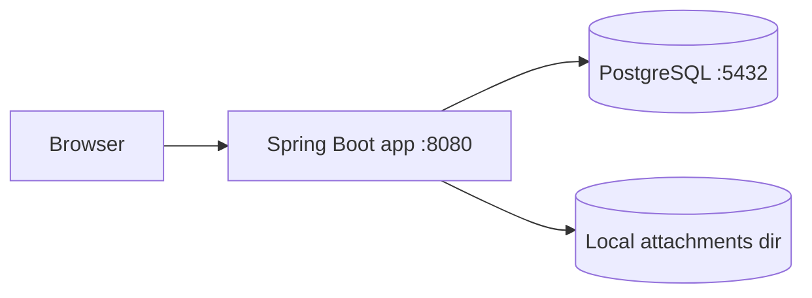
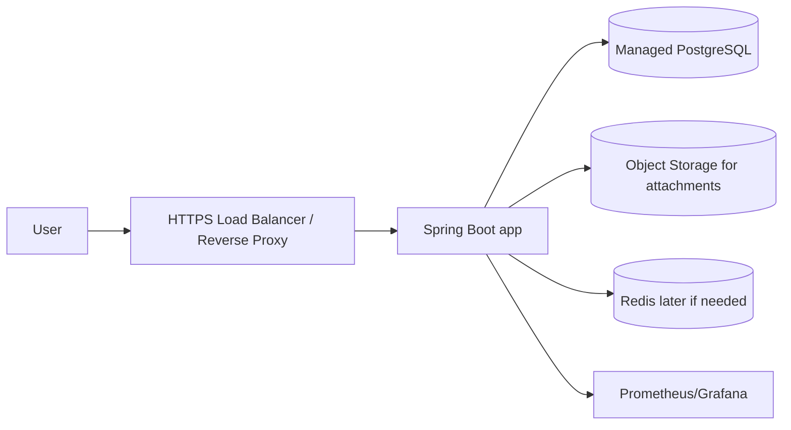

# Deployment

This document explains how `customer-support` is run and deployed in the current state of the repository.

## 1. Current deployment scope

This JavaSpring repository currently includes:

- a Spring Boot backend
- PostgreSQL
- local filesystem storage for attachments
- a Dockerfile for building the application image
- `docker-compose.yml` for running the full stack locally

There is currently **no** Terraform, Kubernetes, GCP infrastructure code, or production deployment script in this repository.

## 2. Source of truth

- Docker Compose: [`docker-compose.yml`](../docker-compose.yml)
- Application image: [`Dockerfile`](../Dockerfile)
- App config: [`src/main/resources/application.yml`](../src/main/resources/application.yml)
- Example env file: [`.env.example`](../.env.example)
- Attachment storage path: `./data/attachments`

## 3. Local deployment architecture

Local deployment currently runs with Docker Compose:



### Services

#### `postgres`

- image: `postgres:16-alpine`
- data volume: `workflow_hub_postgres`
- exposes port `5432`
- used as the main relational database

#### `app`

- built from the project `Dockerfile`
- exposes port `8080`
- reads runtime config from `.env`
- waits for the PostgreSQL healthcheck before starting

## 4. Dockerfile behavior

[`Dockerfile`](../Dockerfile) uses a two-stage build:

1. **Build stage**
   - base image: `maven:3.9.9-eclipse-temurin-17`
   - copies `pom.xml` and `src`
   - runs `mvn -q -DskipTests package`

2. **Runtime stage**
   - base image: `eclipse-temurin:17-jre`
   - copies the built JAR into `/app/app.jar`
   - starts the app with `java -jar`

### Why two stages

- smaller runtime image
- no build tools in production
- cleaner separation between build and run

## 5. Runtime configuration

The app reads most runtime settings from environment variables.

### Example env file

[`.env.example`](../.env.example)

Main variables:

- `SPRING_PROFILES_ACTIVE`
- `SERVER_PORT`
- `SPRING_DATASOURCE_URL`
- `SPRING_DATASOURCE_USERNAME`
- `SPRING_DATASOURCE_PASSWORD`
- `JWT_SECRET`
- `JWT_ACCESS_TOKEN_TTL`
- `JWT_REFRESH_TOKEN_TTL`
- `JWT_REFRESH_COOKIE_NAME`
- `COOKIE_DOMAIN`
- `COOKIE_SECURE`
- `POSTGRES_DB`
- `POSTGRES_USER`
- `POSTGRES_PASSWORD`

### Important app config

From [`application.yml`](../src/main/resources/application.yml):

- multipart upload limit: `10MB`
- default attachment directory: `./data/attachments`
- exposed actuator endpoints:
  - health
  - info
  - metrics
  - prometheus

## 6. Local run flow

### Start everything

```bash
docker compose up --build
```

### What happens

1. Docker builds the Java app image
2. The PostgreSQL container starts
3. The healthcheck waits until the database is ready
4. Spring Boot starts
5. Flyway runs migrations
6. The app serves the API on `http://localhost:8080`

## 7. Database deployment strategy

### Current behavior

- PostgreSQL is the primary database
- schema is managed by Flyway
- the application uses `ddl-auto: validate`

This means:

- tables are not created by Hibernate
- the schema must match the migrations
- application startup fails if entity mappings and DB schema drift

### Why this is good

- schema changes are versioned
- migration history is easier to review
- this is more production-ready and interview-friendly

## 8. Attachment storage strategy

### Current behavior

- file bytes are stored in the local filesystem
- metadata is stored in PostgreSQL
- default local path: `./data/attachments`

### Code path

- upload, download, and delete are handled inside the attachment module
- attachment metadata table: `attachments`

### Deployment implication

This works well for local development, but production should use object storage.

Recommended future production target:

- GCS
- S3-compatible storage
- or another durable object store

## 9. Health and observability

### Actuator endpoints

- `/actuator/health`
- `/actuator/info`
- `/actuator/metrics`
- `/actuator/prometheus`

### Why this matters

Deployment should expose:

- app health
- DB connectivity
- metrics for Grafana and Prometheus

## 10. Production deployment direction

This repository does not yet contain production infrastructure code, but the intended shape is:



### Recommended production components

- HTTPS reverse proxy or load balancer
- managed PostgreSQL
- object storage for attachments
- secrets manager for JWT and database credentials
- observability stack

### Future security notes

- the refresh cookie should be secure in production
- `COOKIE_DOMAIN` should match the real domain
- environment secrets should not live in git

## 11. What is missing from the repo today

Not yet present in this repository:

- Terraform infrastructure code
- GCP deployment scripts
- container orchestration manifests
