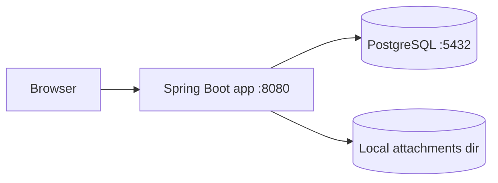
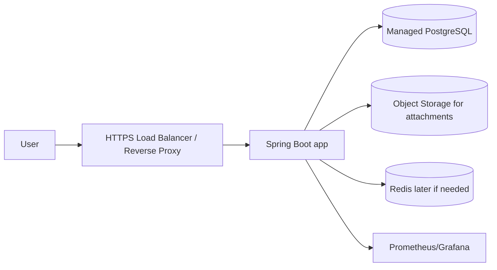

# Deployment

Tài liệu này mô tả cách `customer-support` được chạy và deploy trong trạng thái hiện tại của repo.

## 1. Deployment scope hiện tại

Repo JavaSpring này hiện đã có:

- backend Spring Boot
- PostgreSQL
- local filesystem storage cho attachments
- Dockerfile để build app image
- `docker-compose.yml` để chạy local full stack

Hiện tại **chưa có** Terraform, Kubernetes, GCP infra code hay production deployment script trong repo này.

## 2. Source of truth

- Docker Compose: [`docker-compose.yml`](../docker-compose.yml)
- App image: [`Dockerfile`](../Dockerfile)
- App config: [`src/main/resources/application.yml`](../src/main/resources/application.yml)
- Example env file: [`.env.example`](../.env.example)
- Attachment storage path: `./data/attachments`

## 3. Local deployment architecture

Local deployment hiện tại chạy bằng Docker Compose:



### Services

#### `postgres`

- image: `postgres:16-alpine`
- data volume: `workflow_hub_postgres`
- exposes port `5432`
- used as the main relational database

#### `app`

- built from project `Dockerfile`
- exposes port `8080`
- reads runtime config from `.env`
- waits for PostgreSQL healthcheck before starting

## 4. Dockerfile behavior

[`Dockerfile`](../Dockerfile) uses a two-stage build:

1. **Build stage**
   - base image: `maven:3.9.9-eclipse-temurin-21`
   - copies `pom.xml` and `src`
   - runs `mvn -q -DskipTests package`

2. **Runtime stage**
   - base image: `eclipse-temurin:21-jre`
   - copies the built JAR into `/app/app.jar`
   - starts the app with `java -jar`

### Why two stages

- smaller runtime image
- no build tools in production image
- cleaner separation between build and run

## 5. Runtime configuration

The app reads most runtime settings from environment variables.

### Example env file

[`.env.example`](../.env.example)

Main variables:

- `SPRING_PROFILES_ACTIVE`
- `SERVER_PORT`
- `SPRING_DATASOURCE_URL`
- `SPRING_DATASOURCE_USERNAME`
- `SPRING_DATASOURCE_PASSWORD`
- `JWT_SECRET`
- `JWT_ACCESS_TOKEN_TTL`
- `JWT_REFRESH_TOKEN_TTL`
- `JWT_REFRESH_COOKIE_NAME`
- `COOKIE_DOMAIN`
- `COOKIE_SECURE`
- `POSTGRES_DB`
- `POSTGRES_USER`
- `POSTGRES_PASSWORD`

### Important app config

From [`application.yml`](../src/main/resources/application.yml):

- multipart upload limit: `10MB`
- attachment directory default: `./data/attachments`
- actuator endpoints exposed:
  - health
  - info
  - metrics
  - prometheus

## 6. Local run flow

### Start everything

```bash
docker compose up --build
```

### What happens

1. Docker builds the Java app image
2. PostgreSQL container starts
3. Healthcheck waits until DB is ready
4. Spring Boot app starts
5. Flyway runs migrations
6. App serves API on `http://localhost:8080`

## 7. Database deployment strategy

### Current

- PostgreSQL is the primary database
- schema is managed by Flyway
- application uses `ddl-auto: validate`

That means:

- tables are not created by Hibernate
- schema must match migrations
- app startup fails if entity schema and DB schema drift

### Why this is good

- schema changes are versioned
- easier to review migration history
- better for interview and production readiness

## 8. Attachment storage strategy

### Current behavior

- file bytes are stored in local filesystem
- metadata is stored in PostgreSQL
- default local path: `./data/attachments`

### Code path

- upload/download/delete handled under attachment module
- attachment metadata table: `attachments`

### Deployment implication

This works well for local development, but production should use object storage.

Recommended future production target:

- GCS
- S3-compatible storage
- or another durable object store

## 9. Health and observability

### Actuator endpoints

- `/actuator/health`
- `/actuator/info`
- `/actuator/metrics`
- `/actuator/prometheus`

### Why this matters

Deployment should expose:

- app health
- DB connectivity
- metrics for Grafana / Prometheus

## 10. Production deployment direction

This repo does not yet contain production infra code, but the intended shape is:



### Recommended production components

- HTTPS reverse proxy or load balancer
- managed PostgreSQL
- object storage for attachments
- secrets manager for JWT/database credentials
- observability stack

### Future security notes

- refresh cookie should be secure in production
- `COOKIE_DOMAIN` should match the real domain
- environment secrets should not live in git

## 11. What is missing from repo today

Not yet present in this repo:

- Terraform infra code
- GCP deployment scripts
- container orchestration manifests
- CI/CD deploy job
- object-storage integration
- CDN / reverse proxy config

## 12. Interview explanation

If someone asks “how do you deploy it?”, the clean answer is:

1. The app is containerized with a multi-stage Dockerfile.
2. Docker Compose starts PostgreSQL and the Spring Boot app locally.
3. Flyway manages schema migrations on startup.
4. Attachments are stored on local disk during development.
5. Actuator exposes health and metrics for observability.
6. Production would replace local disk with object storage and use managed DB + HTTPS + secrets management.

## 13. Where to continue next

- add real CI/CD pipeline
- add Terraform or cloud infra docs
- add object storage integration docs
- add frontend deployment notes
