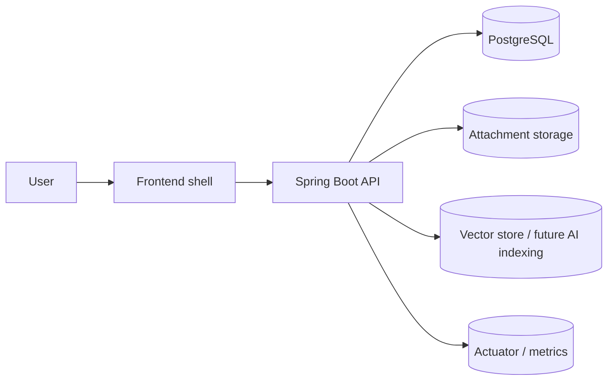

# Project Overview

`customer-support` is a Java Spring backend for a multi-tenant support desk.
The system is designed to let a company manage:

- user authentication with JWT
- organization and workspace tenant context
- customer requests
- comments
- attachments
- team members and roles
- a knowledge base
- notifications
- an AI assistant with tenant limits

## 1. One-line summary

A support desk system for companies where every request, comment, attachment, knowledge item, and assistant action must stay inside a clear tenant scope.

## 2. Business problem

This system solves the following problems:

- support teams handle many requests at the same time
- data must be isolated by company and workspace
- multiple people need to work on the same request
- an audit trail is required to track who changed what
- a knowledge base is needed so the AI can answer from internal documents
- notifications are needed so the team does not miss important events

## 3. Core domain model

### Identity

- `users`
- `sessions`

### Tenant

- `organizations`
- `workspaces`
- `memberships`

### Support workflow

- `workflow_items`
- `workflow_events`
- `comments`
- `attachments`

### Knowledge and AI

- `knowledge_documents`
- `knowledge_chunks`
- `agent_conversations`
- `agent_messages`
- `agent_memory_items`

### Notifications

- `notifications`

## 4. Main user roles

- **Owner**: full company control, team management, and knowledge management
- **Admin**: manage team and workflow inside the tenant scope
- **Member**: work on requests, comment, and upload attachments
- **Viewer**: read-only access

## 5. Main business flows

### Auth flow

1. The user registers or logs in.
2. The backend returns an access token.
3. The backend sets a refresh token cookie.
4. The frontend uses the access token for API calls.
5. When the access token expires, the frontend calls refresh.

### Organization flow

1. The owner creates an organization.
2. The system creates a default workspace.
3. The system creates the owner membership.
4. The team starts working inside that organization.

### Request flow

1. A member, admin, or owner creates a workflow item.
2. The request belongs to the organization and workspace.
3. Other users comment, attach files, and update the status.
4. Every change can be recorded in workflow events.

### Knowledge flow

1. The owner or admin uploads a Markdown document.
2. The document is stored and split into chunks.
3. The chunks are indexed for retrieval.
4. The assistant can cite the matching source.

### Assistant flow

1. The user opens the assistant panel.
2. The assistant reads tenant-scoped data only.
3. The assistant can call approved tools.
4. The assistant returns an answer, action, or citation.

## 6. Architecture at a glance



## 7. Why this project is interview-friendly

This project demonstrates:

- authentication and session management
- multi-tenant authorization
- backend domain modeling
- request lifecycle and audit trails
- file upload and download
- knowledge base and retrieval design
- AI tool calling with guardrails
- Docker-based local deployment
- observability readiness

## 8. Code layout

```text
src/main/java/com/nhat/workflowhub
├── auth
├── organization
├── workspace
├── membership
├── workflow
├── comment
├── attachment
├── notification
├── knowledge
├── ai
├── config
└── common
```

## 9. How the docs fit together

- [`database_schema.md`](./database_schema.md) explains the database table by table
- [`api_design.md`](./api_design.md) explains each endpoint and payload
- [`frontend_architecture.md`](./frontend_architecture.md) explains the intended frontend shell and UI state
- [`deployment.md`](./deployment.md) explains Docker, the database, storage, and the production direction

## 10. Current status

The backend foundation is already implemented.
The knowledge, AI, and notification parts are the next phase and still need fuller service-level implementation.
