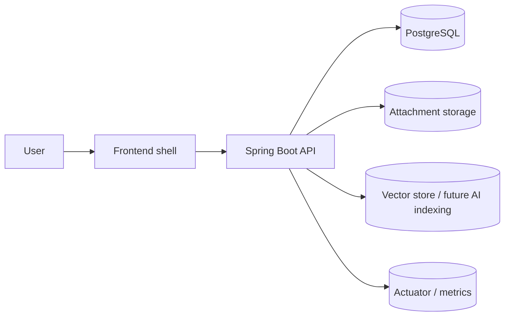

# Project Overview

`customer-support` là backend Java Spring cho một support desk đa tenant.
Mục tiêu của hệ thống là cho phép một company quản lý:

- user đăng nhập bằng JWT
- organization / workspace theo tenant context
- customer requests
- comments
- attachments
- team members / roles
- knowledge base
- notifications
- AI assistant có giới hạn theo tenant

## 1. One-line summary

Một hệ thống support desk cho company, nơi mọi request, comment, file đính kèm, knowledge và assistant action đều phải đi qua tenant scope rõ ràng.

## 2. Business problem

Hệ thống này giải quyết bài toán:

- team support có nhiều request cùng lúc
- dữ liệu phải tách theo company / workspace
- nhiều người cùng làm việc trên một request
- cần audit trail để biết ai đổi gì
- cần knowledge base để AI trả lời theo tài liệu nội bộ
- cần notification để team không bỏ sót sự kiện quan trọng

## 3. Core domain model

### Identity

- `users`
- `sessions`

### Tenant

- `organizations`
- `workspaces`
- `memberships`

### Support workflow

- `workflow_items`
- `workflow_events`
- `comments`
- `attachments`

### Knowledge and AI

- `knowledge_documents`
- `knowledge_chunks`
- `agent_conversations`
- `agent_messages`
- `agent_memory_items`

### Notification

- `notifications`

## 4. Main user roles

- **Owner**: full company control, team management, knowledge management
- **Admin**: manage team and workflow inside tenant scope
- **Member**: work on requests, comment, upload attachments
- **Viewer**: read-only

## 5. Main business flows

### Auth flow

1. user register/login
2. backend returns access token
3. backend sets refresh token cookie
4. frontend uses access token on API calls
5. refresh happens when access token expires

### Organization flow

1. owner creates organization
2. system creates default workspace
3. system creates owner membership
4. team starts working inside that org

### Request flow

1. member/admin/owner creates a workflow item
2. request belongs to organization and workspace
3. other users comment, attach files, update status
4. every change can be recorded in workflow events

### Knowledge flow

1. owner/admin uploads markdown
2. document is stored and chunked
3. chunks are indexed for retrieval
4. assistant can cite the matching source

### Assistant flow

1. user opens assistant panel
2. assistant reads tenant-scoped data only
3. assistant can call approved tools
4. assistant returns answer, action, or citation

## 6. Architecture at a glance



## 7. Why this project is interview-friendly

This project demonstrates:

- authentication and session management
- multi-tenant authorization
- backend domain modeling
- request lifecycle + audit trail
- file upload/download
- knowledge base / retrieval design
- AI tool calling with guardrails
- Docker-based local deployment
- observability readiness

## 8. Code layout

```text
src/main/java/com/nhat/workflowhub
├── auth
├── organization
├── workspace
├── membership
├── workflow
├── comment
├── attachment
├── notification
├── knowledge
├── ai
├── config
└── common
```

## 9. How the docs fit together

- [`database_schema.md`](./database_schema.md) explains the database table-by-table
- [`api_design.md`](./api_design.md) explains each endpoint and payload
- [`frontend_architecture.md`](./frontend_architecture.md) explains the intended FE shell and UI state
- [`deployment.md`](./deployment.md) explains Docker, DB, storage, and production direction

## 10. Current status

The backend foundation is already implemented.
The knowledge/AI/notification parts are currently the next phase and still need fuller service-level implementation.

